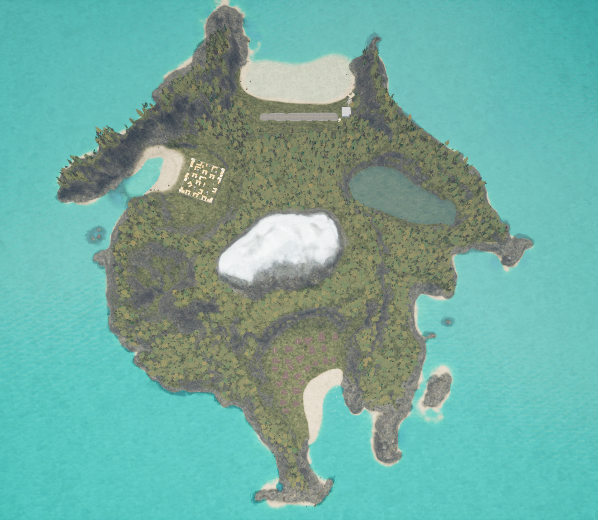
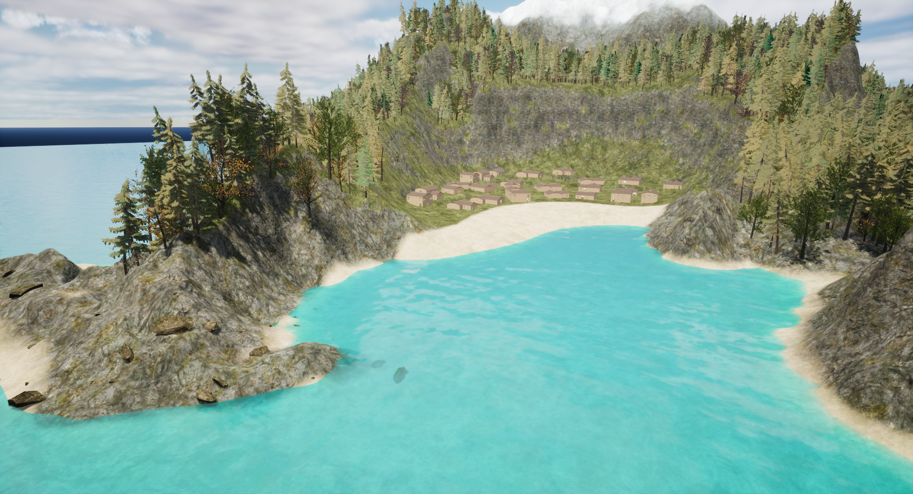
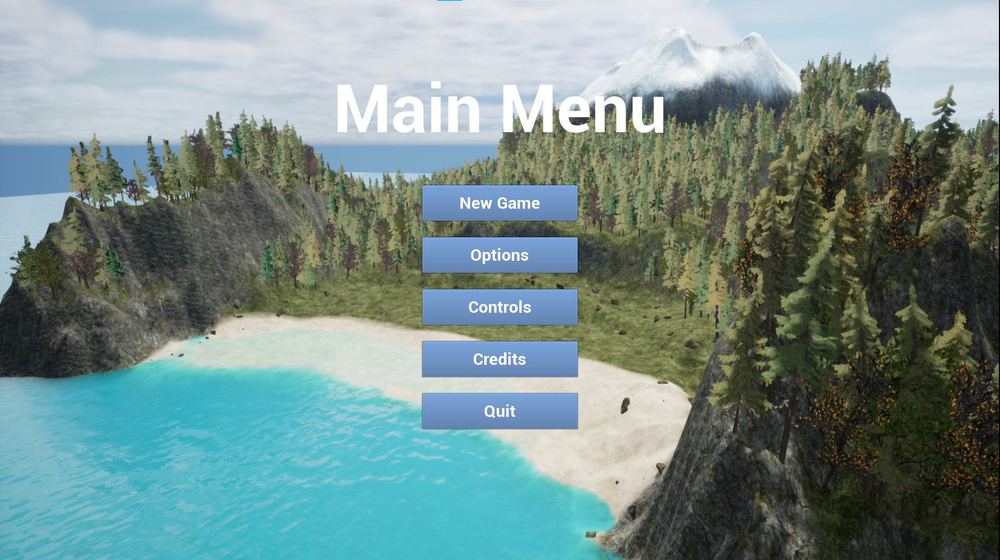
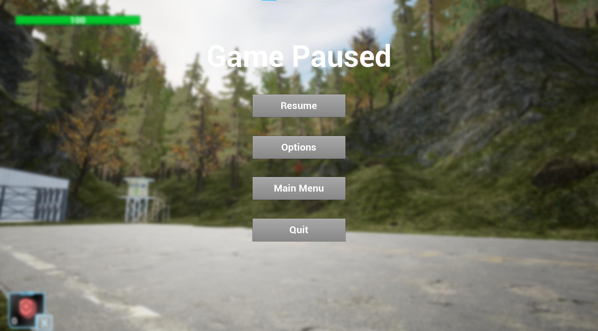

# 3D survival game made for university project work
This 3D survival game was made in my first years of the university with my friend as a university project work. The game made only with Unreal Engine 4. I was the Level Designer of the project.
I made the whole Level myself, my friend did the coding and the functional part of the game. This was one of my first bigger projects in Unreal Engine, my level designing skills improved a lot since then.
I learned about 3D objects, texturing, foliage painting, environment changing, coding, Landscape creating and painting while making the project. i won't talk here about the functional part of the game, since i didn't work in that.
The game uses only free assets.

## Screenshots

## Used Software
- Unreal Engine 4

## Demo
<a href="https://mega.nz/file/vcICnQjS#uAXuvL6bdGTBpByoOhT_lhqyuPLWtOi-TEYMUXlF1qo">Download</a>
